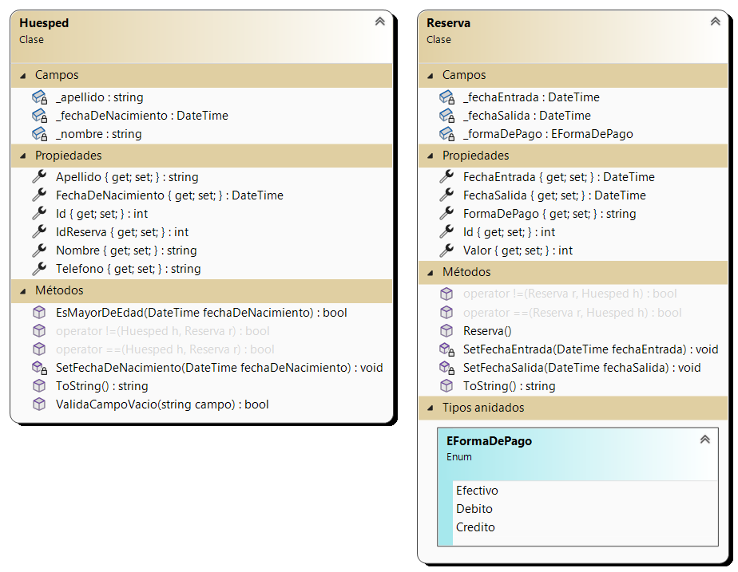
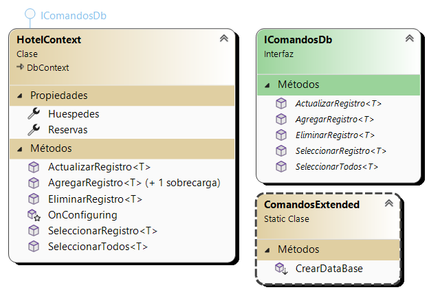
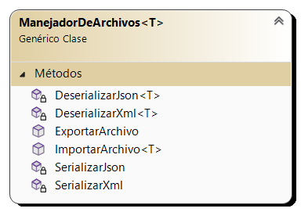
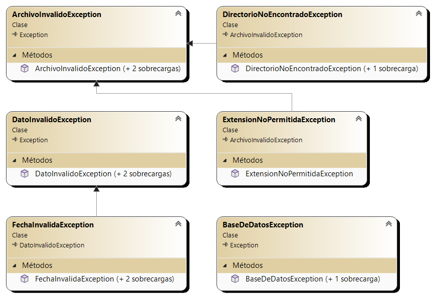
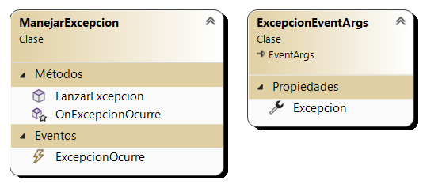

# Sistema de Reservas de un Hotel

El segundo ejercicio integrador de **Laboratorio II** es un sistema de atención al público en `.NET` y `C#` que se encargará de gestionar las reservas de un hotel.

El sistema debe permitir **agregar** tanto las `reservas` como sus respectivos `huéspedes` a la base de datos del hotel a través de un formulario o importando los datos desde un archivo **JSON** o **XML**. Ademas, debe permitir **modificar**, **eliminar** y **buscar** a través de un buscador.

Se utilizarán los contenidos vistos en clase en la segunda parte de la materia:

- [Excepciones](Hotel/Entidades/Excepciones)
- [Pruebas Unitarias](Hotel/TestUnitarios/)
- [Generics](Hotel/Entidades/Archivos/ManejadorDeArchivos.cs)
- [Interfaces](Hotel/Entidades/DataBase/IComandosDb.cs)
- [Archivos y Serialización](Hotel/Entidades/Archivos/ManejadorDeArchivos.cs)
- [SQL y Conexión a Bases de Datos](Hotel/Entidades/DataBase/HotelContext.cs)
- [Delegados y Expresiones Lambda](Hotel/FrmView/MessageBoxHelper.cs)
- [Programación multi-hilo y Concurrencia](Hotel/FrmView/FrmBusqueda.cs)
- [Eventos](Hotel/Entidades/Eventos/ManejarExcepcion.cs)
- [Métodos de Extension](Hotel/Entidades/DataBase/ComandosExtended.cs)

## Diagrama de Clases

Las clases del sistema se encuentran en los siguientes diagramas: 

### Modelos

El programa principal parte de dos entidades base: [Reserva](Hotel/Entidades/Modelos/Reserva.cs) y [Huesped](Hotel/Entidades/Modelos/Huesped.cs). Ambas clases son **tablas** de la base de datos.

La clase `Huesped` representa a una persona que se hospeda en el hotel. Esta clase contiene los datos personales del huésped, como su nombre, apellido, fecha de nacimiento, etc. Además, contiene un **numero de reserva** que representa la reserva que el huésped realizó en el hotel.

La clase `Reserva` representa a una reserva que se realizó en el hotel. Esta clase contiene los datos de la reserva, como la fecha de ingreso y egreso, el numero de la habitación (Id), etc. Ademas, cuenta con un enumerado `EFormaDePago` que será utilizado para indicar la forma de pago de la misma.



De momento solo hay validaciones para las fechas ingresadas y que los datos no sean nulos o vacíos, pero se pueden agregar más validaciones en el futuro.  

### Base de Datos

El sistema cuenta con una **base de datos** `Hotel` que se encarga de almacenar tanto las reservas como los huéspedes en sus respectivas tablas.

La clase `HotelContext` se encarga de realizar la conexión a la base de datos y de crear las tablas en caso de que no existan. Además, se encarga de realizar las consultas a la base de datos como:

- **Agregar** una reserva o un huésped.
- **Modificar** una reserva o un huésped.
- **Eliminar** una reserva o un huésped.
- **Seleccionar** una reserva o un huésped por su Id, o todos los registros de la tabla.

Implementa la interfaz `IComandosDb` que contiene los métodos que se utilizarán para realizar las consultas a la base de datos.

También cuenta con una clase `ComandosExtended` que contiene métodos de extensión para la clase `HotelContext` que se encargan de realizar consultas más complejas a la base de datos.



### Archivos

El sistema cuenta con un `ManejadorDeArchivos` que se encarga de guardar y leer los datos de las reservas y los huéspedes en un archivo **JSON** o **XML**.



La clase cuenta con clases tanto para **serializar** como **deserializar** los datos de los registros que son llamados en los métodos `ExportarArchivo` e `ImportarArchivo` respectivamente según el formato de archivo elegido.

```c#
switch (extension.TrimStart('.').ToLower())
{
    case "json":
        SerializarJson(path, elementos);
        break;

    case "xml":
        SerializarXml(path, elementos);
        break;

    default:
        throw new ExtensionNoPermitidaException();
}
```

Próximamente se agregara la opción de exportar los datos a un archivo **CSV**. 

### Excepciones

El sistema cuenta con una serie de excepciones que se lanzan en caso de que ocurra algún error en el programa. Estas excepciones se encuentran en el **namespace [Excepciones](Hotel/Entidades/Excepciones)**.



Hay excepciones para los siguientes casos:

- **Base De Datos**: Se lanza cuando ocurre un error en la base de datos.
- **Fecha Invalida**: Hereda de **DatoInvalidoException**. Se lanza según la fecha a validar, la fecha de nacimiento, por ejemplo. 
- **Archivo no encontrado**: Se lanza cuando el archivo no se encuentra en el directorio especificado.
- **Extension no permitida**: Se lanza cuando la extensión del archivo no es ni **JSON** ni **XML**.

Ambas heredan de `ArchivoInvalidoException`.

### Hilos y Concurrencia

El sistema cuenta con un **manejador de hilos** que se encarga de realizar las consultas a la base de datos en un hilo aparte para no bloquear la interfaz del usuario.

Se implementa en `FrmBusqueda` para que la búsqueda de los registros se realice en un hilo aparte.

```c#
private void CargarDatos()
{
    if (InvokeRequired)
    {
        BeginInvoke(ActualizarGrilla);
    }
    else
    {
        reservas = gdb.Reservas.ToList();
        huespedes = gdb.Huespedes.ToList();
    }
}
```

Si requiere invocar el hilo principal para actualizar la grilla, se llama al método `BeginInvoke` que se encarga de llamar al método `ActualizarGrilla` en el hilo principal.

```c#
private void ActualizarGrilla()
{
    CargarDatos();
    
    if (rdbHuespedes.Checked)
    {
        dgvHotel.DataSource = huespedes;
    }

    else if (rdbReservas.Checked)
    {
        dgvHotel.DataSource = reservas;
    }
}
```

### Eventos

El sistema cuenta con un **manejador de eventos** que se encarga de manejar las excepciones que ocurren durante el funcionamiento del programa.



La clase `ManejarExcepcion`, que será utilizada en los formularios, tiene un método `LanzarExcepcion` que se encarga lanzar el evento con la excepción llamando a `OnExcepcionOcurre` que es la encargada en **invocar** al evento.

`ExcepcionEventArgs` hereda de `EventArgs` y contiene la excepción que se lanzó en el programa.

---

## Anexos

👉 [Data Grid View](https://learn.microsoft.com/es-es/dotnet/api/system.windows.forms.datagridview?view=windowsdesktop-7.0)

👉 [Apuntes - Programación II y Laboratorio II](https://codeutnfra.github.io/programacion_2_laboratorio_2_apuntes/docs/clases/programa/)

👉 [Save File Dialog](https://learn.microsoft.com/es-es/dotnet/api/system.windows.forms.savefiledialog?view=windowsdesktop-7.0)

👉 [Trabajando con Entity Framework y SQL SERVER by Alejandro Bongioanni](https://www.youtube.com/watch?v=Exz5L0CqFp0)